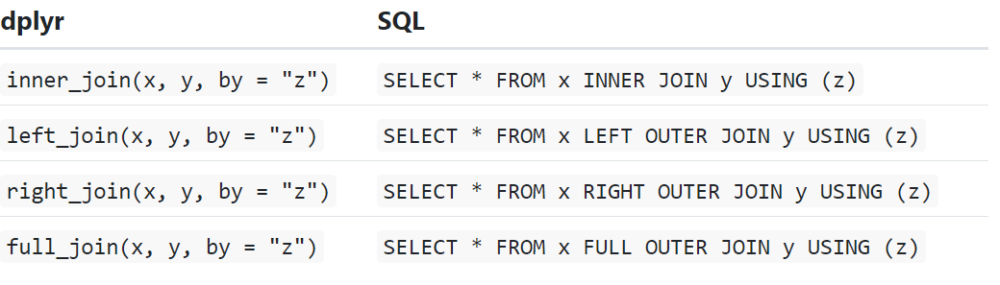

<br>

## 1. Backgound

<br>

## 2. Set-up

Load all required packages for analysis.

```{r setup, message=FALSE}
library(tidyverse)    #for data manipulation
library(knitr)        #for tables

```

<br>

## 3.  **Understanding joins**

To help you learn how joins work, I'm going to use a visual representation:


```{r creatdfs}
x <- tribble(
  ~key, ~val_x,
     1, "x1",
     2, "x2",
     3, "x3"
)
y <- tribble(
  ~key, ~val_y,
     1, "y1",
     2, "y2",
     4, "y3"
)

x
y
```

<br>

## 4. Inner joins

What happens to observations that don't match between the tables?

Can easily lose observations


```{r tidy}
x %>% 
  inner_join(y, by = "key")
```

<br>

## 5. Outer joins

**outer join** keeps observations that appear in at least one of the tables. There are three types of outer joins:

-   A **left join** keeps all observations in `x`.

-   A **right join** keeps all observations in `y`.

-   A **full join** keeps all observations in `x` and `y`.


```{r}
#Can add practice code if necessary 

x %>% 
  left_join(y, by = "key")

?right_join
?full_join

y %>% 
  right_join(x, by = "key")

y %>% 
  full_join(x, by = "key")

```

<br>

## 6. Duplicates in keys or PID

-   Manly useful for one-to-many relationship

-   What if both tables have duplicate keys or PID's?


```{r}
x <- tribble(
  ~key, ~val_x,
     1, "x1",
     2, "x2",
     2, "x3",
     1, "x4"
)
y <- tribble(
  ~key, ~val_y,
     1, "y1",
     2, "y2"
)

y %>%
left_join(x, by = "key")


left_join(y, x, by = "key")

right_join(y, x, by = "key")
```

<br>

## 7. **Filtering joins**

Filtering joins match observations in the same way as mutating joins, but affect the observations, not the variables. There are two types:

-   `semi_join(x, y)` **keeps** all observations in `x` that have a match in `y`.

    

-   `anti_join(x, y)` **drops** all observations in `x` that have a match in `y`

    

    ```{r}
semi_join(x, y, by = "key")
    
    
    anti_join(x, y, by = "key")
    
 
    ```

    <br>

    ## 5. **Compared to other methods**

    

    Stata merge ?
     1,2,3
     
     

    <br>

## 8. Reproducibility

This reproduction of the analysis was run by:

```{r sysinfo, echo=FALSE, message=FALSE, comment=NA, warning=FALSE}

sysinfo <- Sys.info()

sysinfo <- data.frame(keyName=names(sysinfo), value=sysinfo, row.names=NULL)

sysinfo %>% kable()
```

Analysis was run at **`r Sys.time()`**, and using the following Session Info:

```{r sessioninfo, echo=FALSE, results='markdown', message=FALSE, comment=NA, warning=FALSE}
sessionInfo()
```
