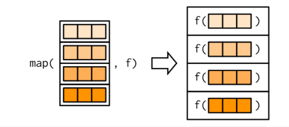

<br>

## 1. Backgound

<br>

## 2. Set-up

Load all required packages for analysis.

```{r setup, message=FALSE}
library(tidyverse)    #for data manipulation
#library(pmthemes)     #for ggplot themes
library(knitr)        #for tables

```

<br>

## 3. Import datasets

Import data required for the analysis.

We will use the penguins dataset from the palmerpenguis r package. Install package if not already installed.

```{r import}
penguins <- palmerpenguins::penguins

penguins
```

<br>

## 4. Recap on last weeks chapter on R vector types

**Atomic vectors in R**

-   Character

-   Integer

-   Numerical/Double

-   Logical

-   Lists

```{r tidy}
letters
typeof(letters)

numbers1 <- c(1L,3L,4L) 
numbers1
typeof(numbers1)

numbers2 <- c(1.2,3,4.5) 
numbers2
typeof(numbers2)

logicals <- c(TRUE,F,T,F,T)
typeof(logicals)

lists <- list(letters, numbers1, numbers2, logicals)
lists
typeof(lists)
```

### 5. Tests for R objects

Convenient in functions when you want to assert the type an R vector

```{r}

letters
is.character(letters)

numbers1 
is.integer(numbers1)

numbers2 
is.numeric(numbers2)

logicals 
is.logical(logicals)

lists
is.list(lists)
```

### 6. Types of vectors in the penguins data set

```{r}

#Accessing a column in a dataframe
#using position

penguins[[1]]

#using names
penguins[["species"]]

#Shortcut to above [[]]
penguins$species

typeof(penguins$species)
```

### 7. Connection between dataframes and lists

Reference on classes and typeof <https://stackoverflow.com/questions/6258004/types-and-classes-of-variables>

```{r}

#Attributes or characteristics that are built ontop of the atomic vectors are called classes
class(penguins)

typeof(penguins)

# Classses Can be asserted the same way as vector types using is.class functions

```

### 8. Using for loops to repeat operations in R

-   **" functions reduce duplication by identifying repeated patterns of code and extract them out into independent pieces that can be easily reused and updated"**

-   **"Another tool for reducing duplication is iteration, which helps you when you need to do the same thing to multiple inputs: repeating the same operation on different columns"**

```{r}
#create a new penguins dataset with numeric variables only
penguins_numeric <- select(penguins, where(is.numeric))

#get mean of each variable

mean(penguins_numeric$bill_length_mm, na.rm = TRUE)

mean(penguins_numeric$bill_depth_mm, na.rm = TRUE)

mean(penguins_numeric$flipper_length_mm, na.rm = TRUE)

mean(penguins_numeric$body_mass_g, na.rm = TRUE)

mean(penguins_numeric$year, na.rm = TRUE)

```

### 9. Using for loop to reduce repetitions in step 8

```{r}

output <- vector("list", length = 5) # vector to store values in

for(i in seq_along(penguins_numeric)) { # the number of times to repeat operation
  
  output[[i]] <- mean(penguins_numeric[[i]], na.rm = T) # the body/operation
  
}


output # all the values in output
```

### 10 Revisiting the scaling function example in the functions chapter 19

The task was to rescale the numeric variables in the penguins

```{r}
penguins_numeric$bill_length_mm <- (penguins_numeric$bill_length_mm - mean(penguins_numeric$bill_length_mm, na.rm = TRUE))/sd(penguins_numeric$bill_length_mm, na.rm = TRUE)

penguins_numeric$bill_depth_mm <- (penguins_numeric$bill_depth_mm - mean(penguins_numeric$bill_depth_mm, na.rm = TRUE))/sd(penguins_numeric$bill_depth_mm, na.rm = TRUE)

penguins_numeric$flipper_length_mm <- (penguins_numeric$flipper_length_mm - mean(penguins_numeric$flipper_length_mm, na.rm = TRUE))/sd(penguins_numeric$flipper_length_mm, na.rm = TRUE)

penguins_numeric$body_mass_g <- (penguins_numeric$body_mass_g - mean(penguins_numeric$body_mass_g, na.rm = TRUE))/sd(penguins_numeric$body_mass_g, na.rm = TRUE)

penguins_numeric$year <- (penguins_numeric$year - mean(penguins_numeric$year, na.rm = TRUE))/sd(penguins_numeric$year, na.rm = TRUE)

penguins_numeric

penguins

```

### 11 Extract common logic into a function

```{r}
rescale_meansd <- function (x) {
  (x-mean(x,na.rm = TRUE))/sd(x, na.rm = TRUE)
}

penguins_numeric <- select(palmerpenguins::penguins, where(is.numeric))
penguins_numeric

penguins_numeric$bill_length_mm <- rescale_meansd(penguins_numeric$bill_length_mm)

penguins_numeric$bill_depth_mm <- rescale_meansd(penguins_numeric$bill_depth_mm)

penguins_numeric$flipper_length_mm <- rescale_meansd(penguins_numeric$flipper_length_mm )

penguins_numeric$body_mass_g <- rescale_meansd(penguins_numeric$body_mass_g)

penguins_numeric$year <- rescale_meansd(penguins_numeric$year)

#View the rescaled data
penguins_numeric

```

### 12 Use for loop to repeat operation

```{r}
#reset the data to original format
penguins_numeric <- select(palmerpenguins::penguins, where(is.numeric))

penguins_numeric

seq_along(penguins_numeric)
1:ncol(penguins_numeric)

for(i in seq_along(penguins_numeric)){
  
  penguins_numeric[[i]] <- rescale_meansd(penguins_numeric[[i]])
  
}

penguins_numeric

penguins_numeric <- select(palmerpenguins::penguins, where(is.numeric))

penguins_numeric %>%
  summarise(across(everything(),mean, na.rm=T))


```

### 13. Part 2

    Replacing for loops with functionals chapter 21 part 2

### Question from last meeting from Micheal

Is it possible to create new variables and maintain the old variables in the data set

```{r}
examble_df <- tribble(
  ~colA, ~colB,
  5,   1,
  8,   2,
  9,   3
)

examble_df

#Multiply each variable by 10 and maintain the old variables

for(i in seq_along(examble_df)){
  names_var <- names(examble_df)[i]
  
  names_var <- paste0(names_var, "times10")
  
  examble_df[[names_var]] <- examble_df[[i]]*10
  
}

examble_df

```

### 14. A brief overview of functional

In summary functionals are functions that accept other functions as arguments. We use this logic to wrap up for loops into functions which can be used instead of the for loops.

What problem do functionals try to solve?

```{r}
penguins_numeric <- select(palmerpenguins::penguins, where(is.numeric))

##Table mean, meadian, and sd of the numeric variables of the dataset

out_vec_mean <- vector("list", length = ncol(penguins_numeric))

for ( i in seq_along(penguins_numeric)) {
  
  out_vec_mean[[i]] <- mean(penguins_numeric[[i]], na.rm = TRUE)
}

out_vec_mean

out_vec_median <- vector("list", length = ncol(penguins_numeric))

for ( i in seq_along(penguins_numeric)) {
  
  out_vec_median[[i]] <- median(penguins_numeric[[i]], na.rm = TRUE)
}

out_vec_median


out_vec_sd <- vector("list", length = ncol(penguins_numeric))

for ( i in seq_along(penguins_numeric)) {
  
  out_vec_sd[[i]] <- sd(penguins_numeric[[i]], na.rm = TRUE)
}

out_vec_sd
```

### 15 How can we reduce the duplication of logic in the code above

Use functionals. We will use functional functions from the purrr package which is part of the tidyverse eco-system of packages. But base R has functionals as well i.e. lapply() and apply()

Example code of functionals

```{r}
simple_map <- function(df, f) {  
  out_vec <- vector("list", length = ncol(df))
  
  for (i in seq_along(df)){
    
    out_vec[[i]] <- f(df[[i]], na.rm = TRUE)
    
  }
  
 out_vec 
}

```

16 \#\#\# Repeating the mean, median, standard deviation excercise with the simple map

Code reads better, you can understand what's going on

```{r}
simple_map(penguins_numeric, f = mean)


simple_map(penguins_numeric, f = median)


simple_map(penguins_numeric, f = sd)
```

17 \#\#\# Repeating the mean, median, standard deviation excercise with the simple map

Using functions from purrr. Made to accept other arguments of functions and edge cases that simple_map above would fail to handle

```{r}
library(purrr)

map(penguins_numeric, mean, na.rm = TRUE)


map(penguins_numeric, median, na.rm = TRUE)


map(penguins_numeric,sd, na.rm = TRUE)


```

### 17 Example involving multiple steps

### map Conceptual diagram

mean(penguins_numeric[[1]]), mean(penguins_numeric[[2]])....mean(penguins_numeric[[last column]]



```{r}
penguins <- palmerpenguins::penguins

#Investigate the linear relationship between flipper_length vs body mass for each type of species and on each island 

lm_model <-  function(df){
  
lm(flipper_length_mm ~ body_mass_g, data = df)
  
}


models_species <- penguins %>% 
  split(.$species) %>% 
  map(lm_model)  %>%
  map(summary) %>%
  map(coef)

models_island <- penguins %>% 
  split(.$island) %>% 
  map(function(df) lm(flipper_length_mm ~ body_mass_g, data = df)) %>%
  map(summary) 

```

### 19 Another example of using maps

```{r}
library(ggplot2)


## function was defined in chapter 19 review
scatter_mass_numdep <- function(data_df,numdep , y_txt= "Bill length (mm)") {
   ggplot(data = data_df, mapping = aes(x= body_mass_g, y = {{numdep}})) +
  geom_point() +
  geom_smooth(method = "lm", se=FALSE) + 
  labs(x = "Body mass in grams", y = y_txt, title = glue::glue("Penguin body mass (g) vs {y_txt}"))
 }

#Plot the relationship between penguin bill_length_mm vs body mass for each species 
models_species_dfs <- penguins %>% 
                      split(.$species)

map(models_species_dfs, scatter_mass_numdep, numdep = bill_length_mm)

#Plot the relationship between penguin bill_length_mm vs body mass for each island
models_island_dfs <- penguins %>% 
                      split(.$island)

models_island_dfs

map(models_island_dfs, scatter_mass_numdep, numdep = bill_length_mm)


```

### 14 References

-   [More on the data Penguins](%5Bhttps://twitter.com/allison_horst/status/1287772985630191617)](<https://twitter.com/allison_horst/status/1287772985630191617>))

-   [Chapter 19 functions](%5Bhttps://r4ds.had.co.nz/functions.html)](<https://r4ds.had.co.nz/functions.html>)

-   [Chapter 20](%5Bhttps://r4ds.had.co.nz/functions.html) vectors](<https://r4ds.had.co.nz/vectors.html>)

-   [Chapter 21 iteration](%5Bhttps://r4ds.had.co.nz/functions.html)](<https://r4ds.had.co.nz/iteration.html#for-loops>)

-   [Chapter 9 Functionals](https://adv-r.hadley.nz/functionals.html)

<br>

## X. Reproducibility

This reproduction of the analysis was run by:

```{r sysinfo, echo=FALSE, message=FALSE, comment=NA, warning=FALSE}

sysinfo <- Sys.info()

sysinfo <- data.frame(keyName=names(sysinfo), value=sysinfo, row.names=NULL)

sysinfo %>% kable()
```

Analysis was run at **`r Sys.time()`**, and using the following Session Info:

```{r sessioninfo, echo=FALSE, results='markdown', message=FALSE, comment=NA, warning=FALSE}
sessionInfo()
```
